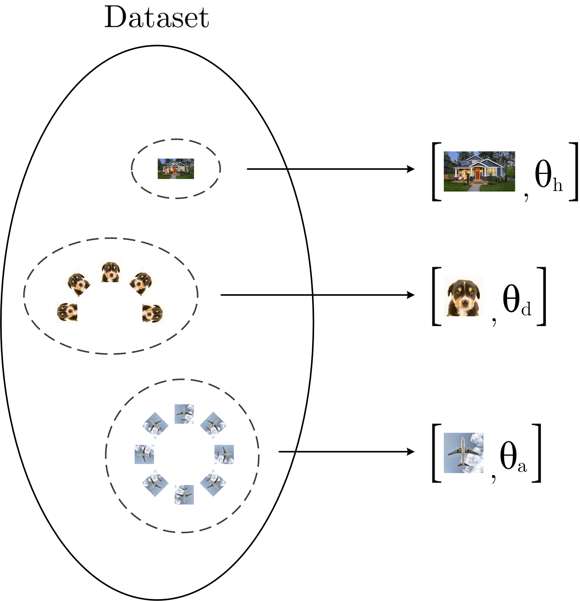
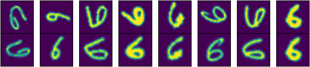
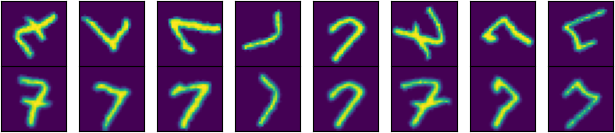
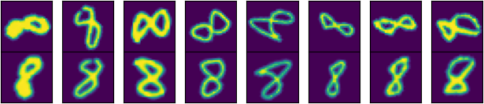
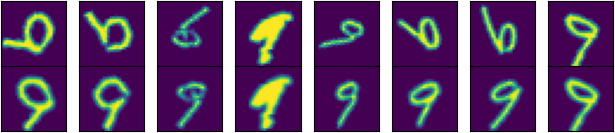
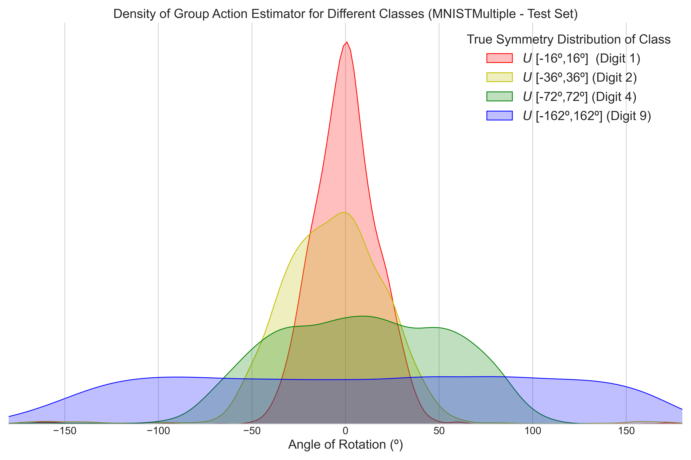

# Self-Supervised Detection of Perfect and Partial Input-Dependent Symmetries

[Alonso Urbano](https://alonsourbano.com/), [David W.Romero](https://www.davidromero.ml/)

[[`Paper`](https://arxiv.org/abs/2312.12223)] [[`Experiments`](#Experiments)] [[`BibTeX`](#Citing-this-paper)]


<p float="left">
  
   
</p>

We introduce a self-supervised method to **detect the level of group symmetry of each input in the dataset without the need for labels**.
Our framework is general enough to accommodate different families of both continuous and discrete symmetry distributions, such as unimodal, 
symmetric distributions and cyclic distributions.

<p float="left">
  
   
</p>
<p float="left">
  
   
</p>

Our models are able to obtain meaningful canonical representations of each input, representing the
center of symmetry of their symmetry distribution in the data.
The level of symmetry of each input in the dataset is learned unsupervisedly during training and can be detected precisely during inference.

<p align="center">
  
</p>

The resulting models can be used to build classifiers to detect out-of-distribution
symmetries, and to generate symmetry standardized, G-invariant datasets in which 
the symmetries have been removed, improving the performance of both supervised and unsupervised methods on downstream
tasks.
# Installation
The code requires `python>=3.9.5`, and relies mainly on `torch>=2.0.0` `torchaudio>=2.0.1`, `torchvision>=0.15.1`
 and `e2cnn>=0.2.3`.

Clone and install the necessary dependencies:
```
git clone https://github.com/aurban0/ssl-sym
cd ssl-sym; pip install -r requirements.txt
pip install torch==2.0.0+cu117 torchvision==0.15.1+cu117 torchaudio==2.0.1 --index-url https://download.pytorch.org/whl/cu117
```

Alternatively, clone and install a complete copy of the environment dependencies as:
```
git clone https://github.com/aurban0/ssl-sym
cd ssl-sym; pip install -r requirements_all.txt
```
# Datasets
To download the datasets used in this paper, navigate to the root directory of the repository and run:
```
cd src
mkdir -p datasets
cd datasets
wget https://osf.io/download/9dn28/
unzip datasets.zip
```
Alternatively, you can manually download the datasets from [OSF](`https://osf.io/download/9dn28/`) and 
place them inside a `datasets` folder under the `src` directory. 

The code used to generate the synthetic MNIST variations to reproduce the experiments in our paper can be found in `create_partial_datasets.py`. 
# Experiments
To reproduce the experiments described in our paper, you can use the `run_experiment.sh` script provided.
If required, set the execution permissions for the script using `chmod +x run_experiment.sh`.

### Training
To train the models from scratch, use the following syntax:
```
./run_experiment.sh -ExperimentName
```
Replace `<ExperimentName>` with one of the available experiments: 
`-MNIST | -RotMNIST60 | -RotMNIST60IEAE | -RotMNIST6090 | -RotMNIST6090IEAE | -MNISTMultiple | -MNISTMultipleIEAE | -RotMNIST | -RotMNISTIEAE | -MNISTMultipleGaussian`.

### Evaluation
After training, the resulting model `best_model_theta.pt` and the symmetry standardized datasets generated
`invariant_dataset_train.pkl`, `invariant_dataset_test.pkl` can be used for evaluation by running the notebooks located
under the `src/experiments` directory.

### Model Checkpoints
Model checkpoints for each experiment are available to download, as well as the corresponding symmetry-standardized
datasets generated, which are needed to reproduce the experiments in the paper. 

To download, navigate to the root directory of the repository and run:
```
cd src
mkdir -p models
cd models
wget https://osf.io/download/43xk7/
unzip models.zip
```
Alternatively, you can manually download the contents from [OSF](https://osf.io/download/43xk7/) and 
place them inside a `models` folder under the `src` directory. By default, the evaluation notebooks are
designed to load model checkpoints located under the `src/models` directory.

# License
The model is licensed under the [MIT license](LICENSE).

# Citing this paper
If you use our models in your research, please use the following BibTeX entry:
```
@misc{urbano2023selfsupervised,
      title={Self-Supervised Detection of Perfect and Partial Input-Dependent Symmetries}, 
      author={Alonso Urbano and David W. Romero},
      year={2023},
      eprint={2312.12223},
      archivePrefix={arXiv},
      primaryClass={cs.CV}
}
```
